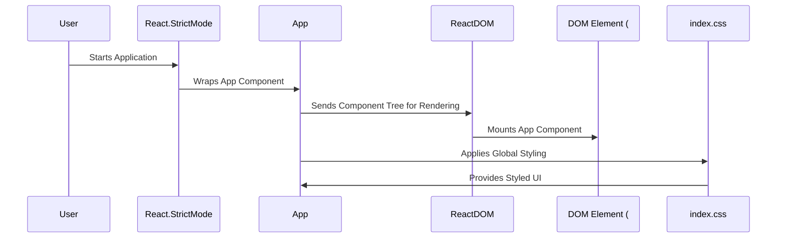

# High-Level Architecture Overview: React Application Entry Point

The provided code snippet represents the entry point of a React application. It is responsible for bootstrapping the application by rendering the root component (`App`) into the DOM. This entry point is a critical part of the application's lifecycle, as it initializes the React component tree and sets up the environment for the application to run.

The context of this code suggests that the application is structured around React components, with `App` serving as the main container for the application's functionality. The use of `React.StrictMode` indicates a focus on adhering to best practices and identifying potential issues in the application during development.

## Key Components

### **React.StrictMode**
- *Responsibility*: Provides additional checks and warnings for the application during development. It helps identify unsafe lifecycle methods, deprecated APIs, and other potential issues, ensuring the application adheres to React's best practices.

### **ReactDOM**
- *Responsibility*: Handles rendering React components into the DOM. It bridges the React virtual DOM with the browser's actual DOM, enabling dynamic updates and efficient rendering.

### **App**
- *Responsibility*: Serves as the root component of the application. It acts as the main container for all other components and encapsulates the application's core functionality and UI.

### **index.css**
- *Responsibility*: Provides global styling for the application. It ensures consistent visual presentation across components and defines the application's overall look and feel.

## Component Interaction Diagram

```mermaid
graph TD
    A[React.StrictMode] --> B[App]
    B --> C[ReactDOM]
    B --> D[index.css]
    C --> E[DOM Element (#root)]
```

### Explanation of Diagram
1. **React.StrictMode** wraps the `App` component to enforce best practices during development.
2. **App** is the central component that encapsulates the application's functionality and interacts with other components.
3. **ReactDOM** renders the `App` component into the DOM element with the ID `root`.
4. **index.css** provides styling for the `App` component and its children, ensuring a consistent UI.

This architecture highlights the modular and hierarchical nature of React applications, where components interact seamlessly to build a dynamic and responsive user interface.
## Component Relationships

### Context Diagram

```mermaid
flowchart TD
    A[React.StrictMode] -->|Wraps| B[App]
    B[App] -->|Renders| C[ReactDOM]
    B[App] -->|Applies Styles| D[index.css]
    C[ReactDOM] -->|Mounts| E[DOM Element (#root)]
```

### Explanation of Flowchart

- **React.StrictMode**: Wraps the `App` component to enforce best practices during development. It ensures that the application adheres to React's guidelines and helps identify potential issues.
  
- **App**: Serves as the central container for the application's functionality. It interacts with:
  - **ReactDOM**: By rendering itself into the DOM, enabling the application to display its UI dynamically.
  - **index.css**: By applying global styles to ensure a consistent look and feel across the application.

- **ReactDOM**: Mounts the `App` component into the DOM element with the ID `root`. This establishes the connection between the React virtual DOM and the browser's actual DOM.

This diagram and explanation provide a high-level understanding of how the main categories interact to fulfill the application's initialization and rendering process.
## Component Relationships

### Detailed Vision

```mermaid
flowchart TD
    A[React.StrictMode]
    A -->|Wraps| B[App]
    
    B[App] -->|Renders| C[ReactDOM]
    C[ReactDOM] -->|Mounts| E[DOM Element (#root)]
    
    B[App] -->|Applies Styles| D[index.css]
    D[index.css] -->|Provides| F[Global Styling]
```

### Explanation of Flowchart

- **React.StrictMode**:
  - Wraps the `App` component to enforce best practices during development. This ensures that the application adheres to React's guidelines and helps identify potential issues such as unsafe lifecycle methods or deprecated APIs.

- **App**:
  - Serves as the central container for the application's functionality. It interacts with:
    - **ReactDOM**: By rendering itself into the DOM, enabling the application to display its UI dynamically.
    - **index.css**: By applying global styles to ensure a consistent look and feel across the application.

- **ReactDOM**:
  - Mounts the `App` component into the DOM element with the ID `root`. This establishes the connection between the React virtual DOM and the browser's actual DOM, allowing the application to render and update efficiently.

- **index.css**:
  - Provides global styling for the application. It ensures that the visual presentation of the `App` component and its children is consistent and adheres to the application's design guidelines.

- **Global Styling**:
  - Represents the output of `index.css`, which is applied to the `App` component and its children to maintain a cohesive and polished user interface.

This detailed vision provides a deeper understanding of how the individual components collaborate to initialize, render, and style the React application. It highlights the modular and hierarchical nature of the system, ensuring clarity for a software engineer audience.
## Integration Scenarios

### Application Initialization and Rendering

The application initialization and rendering scenario describes the process of bootstrapping the React application. It begins with the entry point of the application, where the `React.StrictMode` wraps the `App` component, followed by rendering the `App` into the DOM using `ReactDOM`. This scenario ensures that the application is properly initialized, adheres to best practices, and is styled consistently.

#### Diagram: Sequence of Application Initialization



#### Explanation of Diagram

- **User**:
  - Initiates the application by accessing the entry point, triggering the initialization process.

- **React.StrictMode**:
  - Wraps the `App` component to enforce React's best practices during development. This ensures that the application is robust and adheres to modern React guidelines.

- **App**:
  - Acts as the central container for the application's functionality. It sends its component tree to `ReactDOM` for rendering and interacts with `index.css` to apply global styling.

- **ReactDOM**:
  - Receives the component tree from `App` and mounts it into the DOM element with the ID `root`. This establishes the connection between the React virtual DOM and the browser's actual DOM.

- **DOM Element (#root)**:
  - Serves as the target container in the browser's DOM where the `App` component is rendered.

- **index.css**:
  - Provides global styling to the `App` component and its children, ensuring a consistent and polished user interface.

This integration scenario highlights the seamless collaboration between components during the application's initialization and rendering process. It ensures that the application is properly bootstrapped, adheres to best practices, and delivers a styled and functional UI to the user.
