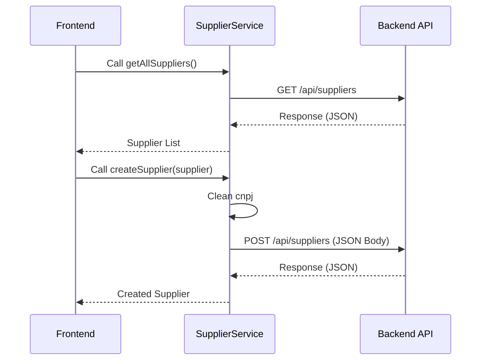
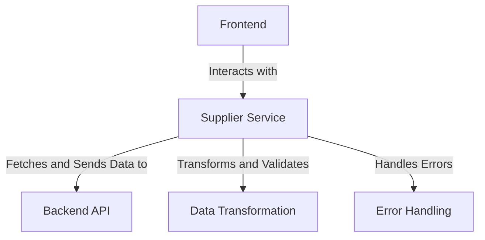
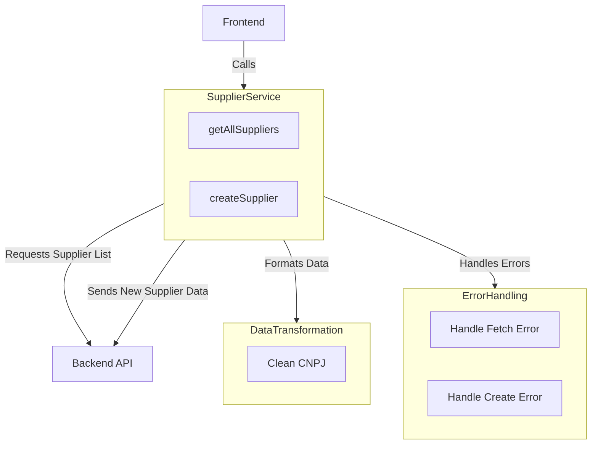
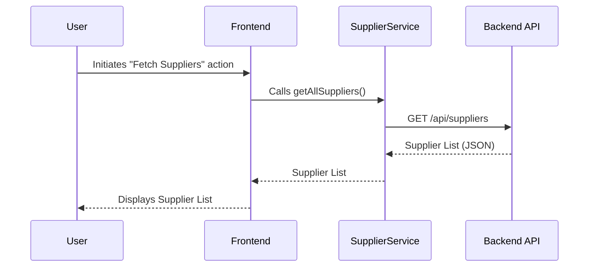
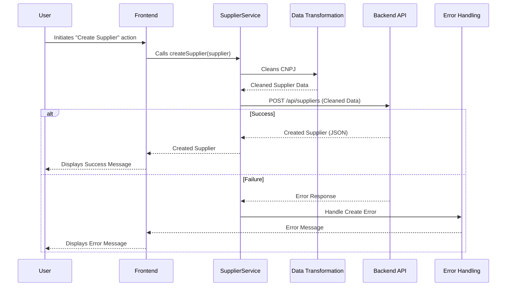

# Supplier Management API Interaction Overview

The provided code snippet focuses on interacting with a Supplier Management API. It includes two main functionalities: fetching all suppliers and creating a new supplier. These operations are essential for managing supplier data in a system, ensuring data integrity and proper communication with the backend API.

## Key Components

### **SupplierService**
- *Responsibility*: Acts as the interface between the frontend and the backend API for supplier-related operations. It encapsulates the logic for fetching and creating suppliers, ensuring proper data formatting and error handling.
- *Key Features*:
  - Fetches all suppliers from the backend API (`getAllSuppliers`).
  - Creates a new supplier by cleaning the `cnpj` attribute and sending the data to the backend API (`createSupplier`).

### **Data Transformation**
- *Responsibility*: Ensures that supplier data is properly formatted before being sent to the backend. Specifically, it cleans the `cnpj` attribute by removing non-numeric characters, which is critical for maintaining data integrity and adhering to backend requirements.

### **Error Handling**
- *Responsibility*: Provides robust error handling for API interactions. It ensures that any issues during the fetch or creation process are caught and communicated effectively, preventing silent failures.

## Interaction Diagram

This diagram illustrates the flow of data and interactions between the frontend, the `SupplierService`, and the backend API. It highlights the key operations of fetching and creating suppliers, along with the data transformation and error handling processes.
## Component Relationships

### Context Diagram

### Explanation of the Flowchart

- **Frontend interacts with SupplierService**: The frontend relies on the `SupplierService` to perform supplier-related operations, such as fetching all suppliers and creating new ones. This encapsulation ensures that the frontend does not directly interact with the backend API, promoting modularity and separation of concerns.

- **SupplierService fetches and sends data to BackendAPI**: The `SupplierService` acts as the intermediary between the frontend and the backend API. It sends requests to the API endpoints (`GET /api/suppliers` and `POST /api/suppliers`) and processes the responses.

- **SupplierService transforms and validates data through DataTransformation**: Before sending supplier data to the backend, the `SupplierService` ensures that the data is properly formatted. For example, it cleans the `cnpj` attribute by removing non-numeric characters, adhering to backend requirements.

- **SupplierService handles errors through ErrorHandling**: Robust error handling is implemented within the `SupplierService` to catch and manage issues during API interactions. This prevents silent failures and ensures that the frontend is informed of any problems.
### Detailed Vision

### Explanation of the Flowchart

- **Frontend calls SupplierService**: The frontend interacts with the `SupplierService` by invoking its methods (`getAllSuppliers` and `createSupplier`) to perform supplier-related operations.

- **SupplierService requests supplier list from BackendAPI**: The `getAllSuppliers` method sends a `GET` request to the backend API to fetch the list of suppliers. The response is processed and returned to the frontend.

- **SupplierService sends new supplier data to BackendAPI**: The `createSupplier` method sends a `POST` request to the backend API with the supplier data. Before sending, it ensures the data is properly formatted.

- **SupplierService formats data through DataTransformation**: The `createSupplier` method uses the `cleanCNPJ` functionality to remove non-numeric characters from the `cnpj` attribute, ensuring the data adheres to backend requirements.

- **SupplierService handles errors through ErrorHandling**: 
  - The `handleFetchError` functionality ensures that any issues during the `getAllSuppliers` operation are caught and communicated effectively.
  - The `handleCreateError` functionality ensures that any issues during the `createSupplier` operation are managed, preventing silent failures and providing meaningful feedback to the frontend.
## Integration Scenarios

### Fetching All Suppliers from the Backend

This scenario describes the process of retrieving the list of all suppliers from the backend API. It demonstrates how the `Frontend` interacts with the `SupplierService` to fetch supplier data and how the service communicates with the backend API to fulfill this request.

#### Explanation

- **User initiates the process**: The user triggers the "Fetch Suppliers" action from the frontend interface.
- **Frontend calls SupplierService**: The frontend invokes the `getAllSuppliers` method of the `SupplierService` to handle the request.
- **SupplierService communicates with BackendAPI**: The `SupplierService` sends a `GET` request to the backend API endpoint (`/api/suppliers`) to retrieve the supplier data.
- **BackendAPI responds with supplier data**: The backend API returns the list of suppliers in JSON format to the `SupplierService`.
- **SupplierService returns data to Frontend**: The `SupplierService` processes the response and sends the supplier list back to the frontend.
- **Frontend displays data to the user**: The frontend presents the supplier list to the user, completing the process.

---

### Creating a New Supplier

This scenario describes the process of creating a new supplier. It highlights how the `Frontend` interacts with the `SupplierService`, how data is transformed before being sent to the backend API, and how errors are handled if the operation fails.

#### Explanation

- **User initiates the process**: The user triggers the "Create Supplier" action from the frontend interface, providing supplier details.
- **Frontend calls SupplierService**: The frontend invokes the `createSupplier` method of the `SupplierService` with the supplier data.
- **SupplierService transforms data**: The `SupplierService` uses the `DataTransformation` component to clean the `cnpj` attribute by removing non-numeric characters.
- **SupplierService sends data to BackendAPI**: The cleaned supplier data is sent to the backend API via a `POST` request to the `/api/suppliers` endpoint.
- **BackendAPI responds**:
  - In case of success, the backend API returns the created supplier data in JSON format. The `SupplierService` processes the response and sends it back to the frontend, which displays a success message to the user.
  - In case of failure, the backend API returns an error response. The `SupplierService` invokes the `ErrorHandling` component to manage the error, which then sends an error message to the frontend. The frontend displays the error message to the user.
